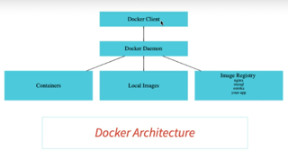
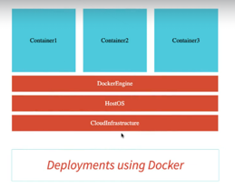
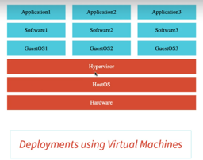

# Microservices

## Evolution
- V1 - Spring Boot 2.0.0 to 2.3.x
- V2 - Spring Boot 2.4.0 to 3.0.0 to

## Old vs technology
*   v2 => v1
1. Spring Cloud Loadbalancer    =>  Ribbon
2. Spring Cloud Gateway         =>  Zuul
3. Resilience4j                 =>  Hystrix
4. Micrometer                   =>  (Replaces Spring Cloud Sleuth)

- Visibility and Monitoring (Zipkin)

# Docker

- recap 126
- when the command is ran
    - docker run -p 5000:5000 in28min/todo-rest-api:1.0.0.RELEASE
    - it downloads image from hub.docker.com  => docker registry
    - Image is set of bytes (static version) => all the things which needs to run application
    - When image is running its a container (running version of image) (running version)
    - For same image we can have multiple containers running

    - Cmd 1 
        - docker run -p 5000:5000 in28min/todo-rest-api:1.0.0.RELEASE
        - docker run -p {hostPort}:{containerPort} {repository}:{version} 
    - Cmd 2
        - docker run -p 5000:5000 -d in28min/todo-rest-api:1.0.0.RELEASE
        - runs in detached mode 
            => with press if ctrl+c wont stop
    - Cmd 3
        - docker logs {containerId}
    - Cmd 4
        - docker conatainer ls          => running containers
        - docker conatainer ls -a       => shows all containers (running and stpped one)
    - Cmd 5
        - docker images => to see images in system 
    - Cmd 6
        - docker container stop {containerId}

## Docker architecture
- The cmd we wrote was in **Docker Client**
    - Responsible for sending cmds to docker daeman
- Then it goes to **Docker Daeman**
    - Responsible for Containers
    - Responsible for Local Images
        - Downloading images
        - Adding new images into it
    - Image Registry
    - 

- Example
    - docker run -p 5000:5000 in28min/todo-rest-api:1.0.0.RELEASE
    - If we write above cmd, docker client sends it to docker daeman
    - Docker daeman first see if the image is available locally, otherwise it downloads it and run it on machine

## Why Docker?
- Docker can also installed cloud is also easy
- Most of cloud provider provide container based services.
- Docker is light weight, therfore very efficient.
- 
    
    

> docker image history
> docker image inspect
> docker image remove {imageId}

## Playing with docker container
- docker container pause {id}
- docker container unpause {id}
- docker container prune        => removes all paused container
- docker container stop {id}    => stops container gracefully
- docker container kill {id}    => stops container as it is
- setting restart policy
    - docker run -p 5000:5000 -d --restart=always in28min/todo-rest-api:1.0.0.RELEASE
        - when we start docker desktop it automatically get started
    - how to stop
        - doocker container stop {id}
        - docker container prune
        - with above step it removes container and restart as it is not on system
- docker event
- docker top {id}
- docker stat {id}
- allocating memory and cpu 
    - docker run -p 5000:5000 -m 512m --cpu-quota 5000 -d in28min/todo-rest-api:1.0.0.RELEASE
        - it uses 512MB memory
        - 5% CPU
            - 100000    => 100%
            - 5000      => 5%
    - now you can check docker stat
- docker system df

## Distributed tracing
- Need 
    - complex call chain
    - how do you debug problems?
    - how do you trace requests across microservices?
> Enter Distributed Tracing (**Zipkin** get in picture)

- Achitecture
    - all container data is saved in db => in can be a in memory or real time db    

- launching zipkin
    - docker run -p 9411:9411 openzipkin/zipkin:2.23